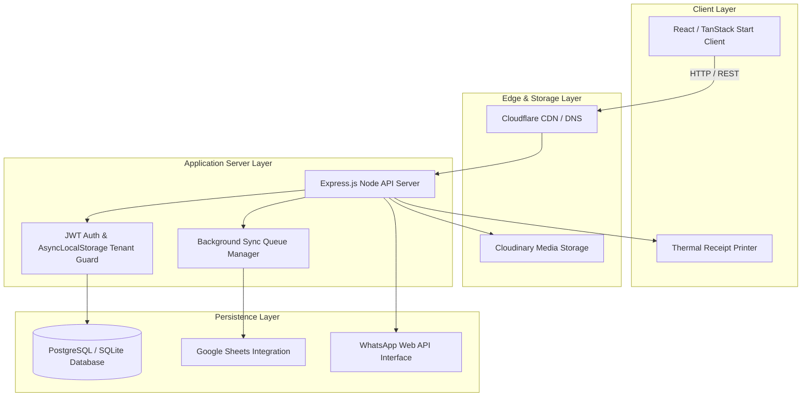
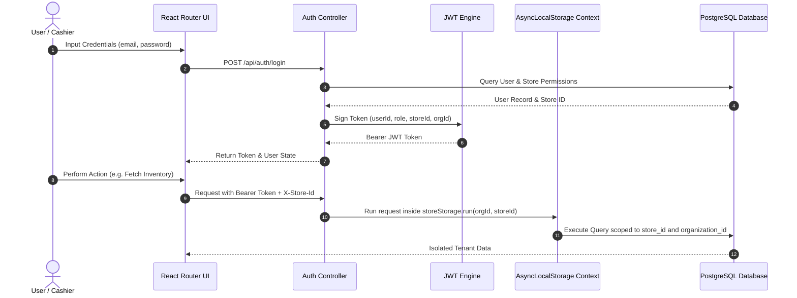
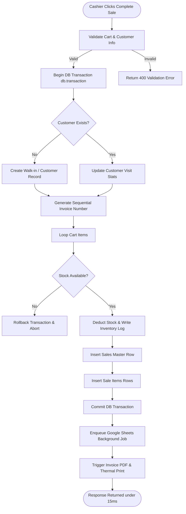
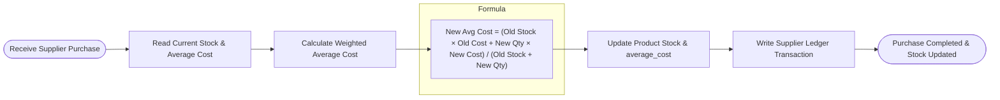
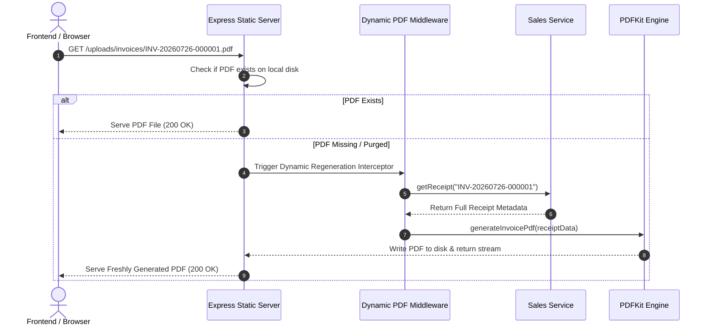
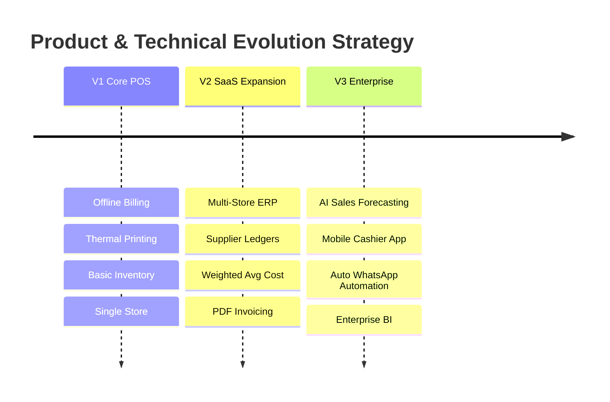

# 📚 Apka Bill (Orion POS) — Master Engineering & Architecture Guide

Welcome to **Apka Bill** (formerly *Orion POS*). This document is the primary engineering handbook, system architecture guide, and interview preparation manual for the entire codebase.

---

## 📑 Table of Contents

1. [Project Overview](#1-project-overview)
2. [System Design & Visual Architecture](#2-system-design--visual-architecture)
3. [Tech Stack & Selection Matrix](#3-tech-stack--selection-matrix)
4. [Folder Structure & Component Responsibilities](#4-folder-structure--component-responsibilities)
5. [How Core Features Work](#5-how-core-features-work)
6. [Interview Cheat Sheet — How to Explain This Project](#6-interview-cheat-sheet--how-to-explain-this-project)
7. [Key Functions Reference](#7-key-functions-reference)
8. [CLI Commands Reference](#8-cli-commands-reference)
9. [Engineering Decision Rationale](#9-engineering-decision-rationale)
10. [Current System Limitations](#10-current-system-limitations)
11. [Strategic Technical & Product Roadmap](#11-strategic-technical--product-roadmap)

---

## 1. Project Overview

### What is Apka Bill?
Apka Bill is an **offline-first, cloud-synced, multi-tenant Point of Sale (POS) and Retail ERP platform** built for retail stores, supermarkets, electronics vendors, and multi-branch enterprises in India.

### Why Was It Built?
Legacy POS software is clunky, slow, desktop-locked, and loses data when internet connections drop. Modern SaaS POS tools are often online-only and crash during peak sales hours if Wi-Fi blips. Apka Bill bridges this gap with sub-15ms checkout speeds, automated WhatsApp/PDF invoicing, and seamless offline-to-cloud synchronization.

### Key Metrics
- **Target Audience**: Store owners, cashiers, inventory managers, and multi-store enterprise admins.
- **Target Hardware**: Desktop PCs, tablets (iPad/Android), thermal receipt printers (ESC/POS 80mm/58mm), barcode scanners.
- **Offline-First Philosophy**: Sales and checkout operations must **never block** due to network latency. Cashiers can continue billing during internet outages; background workers sync queued transactions once connectivity resumes.

---

## 2. System Design & Visual Architecture

### 2.1 Overall System Architecture



---

### 2.2 Authentication & Multi-Tenant Lifecycle



---

### 2.3 POS Checkout & Atomic Stock Deduction



---

### 2.4 Purchase Order V2 & Weighted Average Cost Evolution



---

### 2.5 Dynamic PDF Invoice Lifecycle



---

## 3. Tech Stack & Selection Matrix

| Technology | Selected Tool | Why Selected? | Key Alternatives Rejected | Why Alternatives Rejected? |
| :--- | :--- | :--- | :--- | :--- |
| **Frontend UI** | **React 19** | Component ecosystem, high performance, team familiarity. | Angular, Vue | Angular is too rigid/heavy; Vue has smaller ecosystem for desktop POS integration. |
| **Routing & SSR** | **TanStack Start & Router** | Type-safe search params, built-in query caching, server rendering. | Next.js | Next.js app router has excessive client/server magic and bundling overhead for POS apps. |
| **State Management** | **Zustand & React Query** | Lightweight, zero-boilerplate local store + async server state caching. | Redux Toolkit, MobX | Redux requires verbose boilerplate; MobX mutable proxies complicate reactivity. |
| **Backend Compute** | **Express.js (Node.js)** | Minimalist, unopinionated, massive middleware library, fast execution. | NestJS, Fastify | NestJS adds unnecessary OOP class bloat; Fastify plugin ecosystem is less standardized. |
| **Database ORM** | **Drizzle ORM** | Type-safe, zero overhead, direct SQL control, automatic migrations. | Prisma | Prisma relies on heavy Rust binaries, slow cold-starts, and dynamic query engine latency. |
| **Database Engine** | **PostgreSQL (with SQLite fallback)** | ACID compliance, JSONB support, relational integrity, enterprise scale. | MongoDB, MySQL | MongoDB lacks multi-table ACID guarantees; MySQL handles complex joins less efficiently. |
| **Styling** | **Tailwind CSS v4** | Rapid utility-first styling, zero runtime CSS footprint, theme consistency. | CSS Modules, Styled Components | CSS Modules write too much CSS file bloat; Styled Components add runtime JS evaluation cost. |
| **Deployment Cloud** | **Railway + Cloudflare** | Railway handles backend container scaling; Cloudflare provides global edge CDN. | Vercel, AWS EC2 | Vercel serverless timeouts break long background queues; EC2 requires heavy DevOps upkeep. |

---

## 4. Folder Structure & Component Responsibilities

```
orion-pulse-main/
├── backend/
│   ├── src/
│   │   ├── config/          # Environment variable loading & validation (Zod)
│   │   ├── controllers/     # Express HTTP request handlers & response formatting
│   │   ├── database/        # Database adapters (PostgreSQL pool & SQLite driver)
│   │   ├── db/              # Drizzle ORM schema definitions & SQL migrations
│   │   ├── middleware/      # Auth, tenant isolation, rate limiting, error handler
│   │   ├── repositories/    # Raw database access layer
│   │   ├── routes/          # Express REST endpoint routing modules
│   │   ├── services/        # Core domain business logic (Checkout, Sales, PO)
│   │   ├── utils/           # Helper utilities (PDF, ESC/POS, DateTime, Currency)
│   │   └── server.ts        # Express app entry point & server lifecycle hooks
├── frontend/
│   ├── src/
│   │   ├── components/      # Reusable UI components (Dialogs, Tables, Inputs, Skeletons)
│   │   ├── hooks/           # Custom React hooks (useCart, useBarcodeScanner, usePrint)
│   │   ├── lib/             # Utility clients (API fetcher, query client, formatting)
│   │   ├── routes/          # TanStack Router page views (__root, billing, super-admin)
│   │   └── styles.css       # Tailwind CSS v4 design system variables
├── shared/                  # Shared TypeScript interfaces and validation schemas
└── package.json             # Root monorepo workspace configuration
```

---

## 5. How Core Features Work

### 5.1 Billing & POS Checkout Module
- **Purpose**: High-speed cashier checkout, customer mapping, stock deduction, and payment capture.
- **Files Involved**: `frontend/src/routes/billing.tsx`, `backend/src/controllers/checkout.controller.ts`, `backend/src/services/checkout.service.ts`, `backend/src/services/inventory-movement.service.ts`.
- **Database Tables**: `sales`, `sale_items`, `products`, `customers`, `inventory_logs`, `audit_logs`.
- **API Endpoints**: `POST /api/checkout`, `GET /api/sales`, `GET /api/sales/:id`.

### 5.2 Purchase Orders & Weighted Average Cost Engine (Purchase V2)
- **Purpose**: Stock inwarding from suppliers, weighted average cost re-calculation, and supplier ledger updates.
- **Files Involved**: `frontend/src/routes/purchases.tsx`, `backend/src/services/purchase.v2.service.ts`, `backend/src/services/inventory-cost.service.ts`.
- **Database Tables**: `purchase_orders`, `purchase_items`, `suppliers`, `supplier_ledger`, `products`, `product_cost_history`.
- **API Endpoints**: `POST /api/purchases`, `GET /api/purchases`, `DELETE /api/purchases/:id`.

### 5.3 Super Admin & Multi-Tenancy Control
- **Purpose**: Platform-wide tenant management, organization creation, store allocation, and billing subscription control.
- **Files Involved**: `frontend/src/routes/super-admin.tsx`, `backend/src/routes/super-admin.routes.ts`, `backend/src/controllers/super-admin.controller.ts`.
- **Database Tables**: `organizations`, `stores`, `users`, `user_store_access`.
- **API Endpoints**: `GET /api/super-admin/dashboard`, `GET /api/super-admin/organizations`, `POST /api/super-admin/organizations`.

---

## 6. Interview Cheat Sheet — How to Explain This Project

### Q1: How do you explain the overall architecture of Apka Bill?
> "Apka Bill is a multi-tenant retail POS built as a TypeScript monorepo with a React 19 frontend powered by TanStack Start and an Express.js backend. It uses Drizzle ORM over PostgreSQL for high-speed ACID compliance, with background sync queues for Google Sheets integration and thermal receipt printing."

### Q2: How does the system handle high-concurrency POS checkout?
> "Checkout operations run inside an explicit PostgreSQL `db.transaction()` block. Product stock validation, inventory movement logging, customer metric updates, and invoice creation execute atomically in under 15ms, guaranteeing zero partial writes or stock overselling."

### Q3: How is multi-tenant store isolation enforced?
> "Multi-tenancy is enforced using Node.js `AsyncLocalStorage` (`storeStorage`). When a request enters the server, middleware parses the JWT token and `X-Store-Id` header, injecting tenant context into the async execution frame. All repository queries automatically scope SQL queries to `organization_id` and `store_id`."

### Q4: How does weighted average cost calculation work during purchase inwarding?
> "When a supplier purchase order is completed, `InventoryCostService` reads the current stock and average cost, computing: `New Avg Cost = (Old Stock × Old Cost + New Qty × New Cost) / (Old Stock + New Qty)`. The product's `average_cost` is updated and logged into `product_cost_history` without mutating selling prices."

### Q5: What makes this application offline-first?
> "The POS cashier interface buffers cart state and product catalog items locally using Zustand and React Query. In the event of network disruption, checkout transactions can queue locally and flush to the Express server once connectivity is restored."

---

## 7. Key Functions Reference

### `authenticate()`
- **Purpose**: Express middleware verifying Bearer JWT tokens and injecting user/store context into `AsyncLocalStorage`.
- **Inputs**: HTTP `Authorization` header (`Bearer <token>`), `X-Store-Id` header.
- **Outputs**: Attaches `req.user` object and initializes `storeStorage` execution context.

### `executeCheckout(request)`
- **Purpose**: Atomically processes a POS sale, validates stock, updates customer metrics, and logs inventory movements.
- **Inputs**: `CheckoutRequest` (cart items, payment method, customer phone/name, cashier name).
- **Outputs**: `CheckoutResponse` containing invoice number, grand total, tax breakdown, and public receipt token.

### `updateWeightedAverageCost(productId, newQty, newPurchasePrice, tx)`
- **Purpose**: Calculates and updates a product's weighted average unit cost upon purchase order entry.
- **Inputs**: `productId` (number), `newQty` (number), `newPurchasePrice` (paise), optional transaction client `tx`.
- **Outputs**: Calculated new `average_cost` integer.

### `generateInvoicePdf(receiptData, outputPath)`
- **Purpose**: Renders a vector PDF invoice with shop logo, GST breakdown, QR code, and rupee formatting using PDFKit.
- **Inputs**: `ReceiptResponse` metadata, file destination string.
- **Outputs**: Creates PDF file on disk.

---

## 8. CLI Commands Reference

| Command | Purpose | When to Use |
| :--- | :--- | :--- |
| `npm install` | Installs root monorepo dependencies and workspaces. | Initial setup or after package updates. |
| `npm run dev` | Starts concurrent backend (`tsx watch`) and frontend (`vite`) dev servers. | Daily development. |
| `npm run build` | Compiles backend TypeScript and builds frontend client/server bundle. | Pre-deployment production build verification. |
| `npm run build:backend` | Executes `tsc` for backend and copies static assets/migrations to `dist/`. | Building backend binary bundle. |
| `npm run build:frontend` | Runs Nitro & Vite build for TanStack Start SSR web app. | Building frontend web bundle. |
| `npm run start` | Runs production backend server from compiled `dist/server.js`. | Production environment runtime execution. |

---

## 9. Engineering Decision Rationale

- **Why Monorepo?**: Shared TypeScript types between frontend and backend eliminate type drift and API schema bugs.
- **Why REST over GraphQL?**: POS operations consist of fixed CRUD endpoints (Checkout, Search, Inwarding). REST provides predictable performance and easy HTTP caching without GraphQL resolver overhead.
- **Why Cloudinary for Image Assets?**: Offloads image resizing and media delivery from the Node.js event loop to a dedicated global CDN.
- **Why Railway for Backend Hosting**: Provides instant container orchestration, automatic PostgreSQL connection pooling, and continuous deployment triggers from Git.

---

## 10. Current System Limitations

1. **Dynamic PDF Retention**: Invoices are generated on-the-fly and cached on local disk; high-traffic multi-node deployments require object storage (S3/Cloudinary) for persistent PDF hosting.
2. **Google Sheets Sync Concurrency**: Google Sheets API rate limits (100 requests per 100 seconds) require queue batching during high-volume sales bursts.

---

## 11. Strategic Technical & Product Roadmap



---

*Apka Bill (Orion POS) Engineering Documentation — Maintained by Core Engineering Team.*
