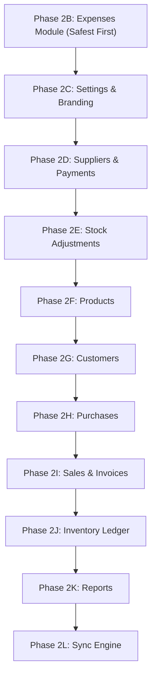

# Apka Bill — Phase 2: Modular Monolith Architecture & Migration Plan

## 1. Executive Summary & Architectural Vision

Apka Bill is a production single-store / multi-tenant SaaS POS platform powering:
1. **Web / PWA Application** (`frontend/`)
2. **Mobile Expo Android Application** (`mobile-expo/`)

Both clients share **one backend**, **one PostgreSQL database**, **one business model**, and **one set of API contracts**.

The objective of Phase 2 is **NOT** to build microservices or split into separate deployment artifacts. The goal is to evolve the current layered codebase into an **Incremental Modular Monolith** where:
- Each domain module is self-contained with explicit boundaries (`routes`, `controller`, `service`, `repository`, `types`, `validation`).
- Domain logic is decoupled from HTTP transport.
- Cross-module dependencies go through defined service interfaces, eliminating cross-module database mutations.
- 100% of existing REST endpoint URLs, request shapes, and response contracts are preserved.

---

## 2. Current Architecture & Structural Audit

### Directory Layout
```text
backend/src/
├── config/             # Environment & runtime configuration
├── controllers/        # Express request/response handlers (28 controllers)
├── database/           # Legacy sqlite/mock adapters & init scripts
├── db/                 # PostgreSQL connection pool, schema (31 tables), AsyncLocalStorage context
├── logger/             # Winston structured logging
├── middleware/         # Auth, tenant boundary, rate limiting, error handler, request logger
├── repositories/       # Drizzle data access layers (15 postgres repositories)
├── routes/             # Express Router definitions (33 route files)
├── schemas/            # Zod & legacy SQL schema files
├── services/           # Domain business logic (34 service files)
├── types/              # TypeScript interface definitions
├── utils/              # Datetime, formatting, errors, barcode helpers
└── validation/         # Request input validation schemas
```

---

## 3. Comprehensive Module-by-Module Audit (17 Areas)

| # | Module | Routes & Controller | Service & Repository | Database Tables | Cross-Module Dependencies | Risk of Extraction |
| :--- | :--- | :--- | :--- | :--- | :--- | :---: |
| **1** | **Authentication** | `auth.routes.ts`<br>`auth.controller.ts` | `auth.middleware.ts` | `users`, `stores`, `organizations` | Tenant Context, User Management | **MEDIUM** |
| **2** | **Tenant / Store** | `organization.routes.ts`<br>`store.routes.ts`<br>`super-admin.routes.ts` | `context.ts` (AsyncLocalStorage) | `organizations`, `stores`, `users` | Auth, All domain modules | **HIGH** |
| **3** | **Products** | `product.routes.ts`<br>`product.controller.ts` | `product.service.ts`<br>`product.repository.ts` | `products`, `categories` | Inventory, Checkout, Sales, Purchases, Sync | **MEDIUM** |
| **4** | **Customers** | `customer.routes.ts`<br>`customer.controller.ts` | `customer.service.ts`<br>`customer.repository.ts` | `customers` | Checkout, Sales, WhatsApp Share, Sync | **LOW-MEDIUM** |
| **5** | **Sales & Billing** | `sales.routes.ts`<br>`checkout.routes.ts`<br>`sales.controller.ts` | `sales.service.ts`<br>`checkout.service.ts`<br>`sale.repository.ts` | `sales`, `sale_items`, `audit_logs` | Products, Customers, Inventory, Receipts, Returns | **HIGH** |
| **6** | **Inventory** | `inventory.routes.ts`<br>`inventory.controller.ts` | `inventory-movement.service.ts`<br>`inventory-cost.service.ts` | `inventory_movements`, `inventory_logs`, `product_cost_history` | Products, Sales, Purchases, Stock Adjustments | **HIGH** |
| **7** | **Suppliers** | `supplier.routes.ts`<br>`supplier-payment.routes.ts` | `supplier.service.ts`<br>`supplier-payment.service.ts` | `suppliers`, `supplier_payments`, `supplier_ledger` | Purchases | **LOW** |
| **8** | **Purchases** | `purchase.routes.ts`<br>`purchase.controller.ts` | `purchase.v2.service.ts`<br>`purchase.v2.repository.ts` | `purchase_orders`, `purchase_items` | Suppliers, Products, Inventory Movements, Ledger | **MEDIUM-HIGH** |
| **9** | **Expenses** | `expense.routes.ts`<br>`expense.controller.ts` | *(Embedded in controller)* | `expenses`, `expense_categories` | Reports / Analytics | **LOW (Safest)** |
| **10** | **Stock Adjustments** | `stock-adjustment.routes.ts`<br>`stock-adjustment.controller.ts` | `stock-adjustment.service.ts`<br>`stock-adjustment.repository.ts` | `stock_adjustments`, `stock_adjustment_items` | Products, Inventory Movements | **LOW-MEDIUM** |
| **11** | **Settings** | `settings.routes.ts`<br>`settings.controller.ts` | `settings.service.ts`<br>`settings.repository.ts` | `settings` | Branding, Receipts, Thermal Print, Sync | **LOW** |
| **12** | **Branding** | `settings.routes.ts` | `branding.service.ts`<br>`image.service.ts` | `settings`, `stores` | Receipts, PDF Service, Settings | **LOW** |
| **13** | **Reports & Analytics** | `reports.routes.ts`<br>`analytics.routes.ts`<br>`profit.routes.ts` | `reports.service.ts`<br>`analytics.service.ts`<br>`profit.service.ts` | `sales`, `expenses`, `products`, `customers` | Read-only aggregation across all tables | **LOW-MEDIUM** |
| **14** | **Invoice / Receipt** | `invoice.routes.ts`<br>`invoice.controller.ts` | `receipt-builder.service.ts`<br>`pdf.service.ts`<br>`invoice.service.ts` | `sales`, `sale_items`, `settings` | Sales, Customers, Settings, Branding | **MEDIUM** |
| **15** | **WhatsApp Share** | `sales.routes.ts`<br>`checkout.routes.ts` | `share.service.ts` | `sales`, `customers` | Sales, Public Invoice URL | **LOW** |
| **16** | **Sync Engine** | `sync.routes.ts`<br>`sync.service.ts` | `SyncQueueManager`<br>`sync.repository.ts` | `sync_queue`, `sync_events` | Expo SQLite Outbox, Google Sheets | **HIGH (Critical)** |
| **17** | **Printing Backend** | `printer.routes.ts`<br>`printer.service.ts` | `escpos.service.ts`<br>`print-queue.service.ts` | In-memory / USB spooler | Sales, Settings | **LOW** |

---

## 4. Top 10 Architectural Problems Identified

1. **Direct Database Queries Inside Controllers**:
   - `expense.controller.ts`, `auth.controller.ts`, `store.controller.ts`, `organization.controller.ts`, `user.controller.ts`, and `super-admin.controller.ts` execute raw Drizzle queries directly rather than delegating to domain services/repositories.
2. **Cross-Module Direct Table Mutations**:
   - `checkout.service.ts` and `purchase.v2.service.ts` directly mutate tables of other domains (`customers`, `suppliers`, `products`, `inventory_movements`, `supplier_ledger`) instead of calling explicit domain service operations.
3. **Receipt & PDF Generation Mixed with Sales Persistence**:
   - `sales.service.ts` contains raw font loading, PDF binary generation, and receipt DTO building mixed with invoice persistence, voiding, and editing logic.
4. **Validation Logic Fragmentation**:
   - Validation is scattered across `schemas/*.ts` (Zod), `validation/*.ts` (custom validation functions), and inline imperative assertions inside controllers.
5. **Legacy vs. V2 Duplicate Implementations**:
   - `purchase.repository.ts` + `purchase.service.ts` exist concurrently with `purchase.v2.repository.ts` + `purchase.v2.service.ts`.
6. **Dual Route Mounting in Server Initialization**:
   - `server.ts` mounts almost all routes twice (`/api/products` and `/products`, `/api/sales` and `/sales`, `/api/expenses` and `/expenses`), increasing maintenance burden.
7. **Sync Engine Directly Queries Domain Tables**:
   - `sync.service.ts` runs ad-hoc queries on `products`, `customers`, and `settings` rather than utilizing repository abstractions.
8. **Utility File Business Logic Creep**:
   - Date formatting and Kolkata timezone conversion are duplicated across `datetime.ts`, `date-utils.ts`, and service files.
9. **Inconsistent Error Handling Responses**:
   - Some controllers catch errors and return `res.status(400).json({ error: ... })`, while others pass them to `next(err)` for the global `errorMiddleware`.
10. **Lack of Encapsulated Module Namespaces**:
    - Modifying a feature currently requires hopping between 6 different top-level folders (`routes/`, `controllers/`, `services/`, `repositories/`, `validation/`, `types/`).

---

## 5. Target Architecture: Incremental Modular Monolith

```text
backend/src/
├── core/
│   ├── auth/              # JWT verification, password hashing, role guards
│   ├── tenant/            # AsyncLocalStorage tenant context & anti-tampering
│   ├── database/          # PostgreSQL connection, Drizzle schema & migrations
│   ├── errors/            # AppError, ValidationError, NotFoundError, ConflictError
│   ├── middleware/        # Global requestLogger, rateLimiter, errorMiddleware
│   └── utils/             # Datetime, formatting, pagination helpers
│
└── modules/
    ├── expenses/          # [PHASE 2B] Self-contained expense tracking
    ├── settings/          # [PHASE 2C] Store configuration & branding
    ├── suppliers/         # [PHASE 2D] Supplier directory & payments
    ├── stock-adjustments/ # [PHASE 2E] Inventory variance adjustments
    ├── products/          # [PHASE 2F] Product catalog & categories
    ├── customers/         # [PHASE 2G] Customer directory & lookup
    ├── purchases/         # [PHASE 2H] POs, receiving & supplier ledger
    ├── sales/             # [PHASE 2I] Checkout, billing, invoices & receipts
    ├── inventory/         # [PHASE 2J] Central movement audit ledger & stock
    ├── reports/           # [PHASE 2K] Financial & sales analytics
    └── sync/              # [PHASE 2L] Expo offline sync & cloud backup
```

### Module Structure Standard
Every domain module under `src/modules/<name>/` will follow a uniform structure:
```text
src/modules/<name>/
├── <name>.routes.ts       # Route endpoints & middleware attachments
├── <name>.controller.ts   # HTTP request mapping, validation & status responses
├── <name>.service.ts      # Pure domain business rules & transactional workflows
├── <name>.repository.ts   # Database CRUD queries scoped by (organization_id, store_id)
├── <name>.types.ts        # Domain DTOs, request & response interfaces
├── <name>.validation.ts   # Zod request validators
└── index.ts               # Public interface exporting router and public service methods
```

---

## 6. Migration Priority Sequence



---

### Phase 2B: FIRST MODULE — Expenses Module

- **Module**: `expenses`
- **Why this module**:
  - Lowest architectural risk in the entire codebase.
  - Zero coupling with active billing, stock ledger, or checkout transactions.
  - Currently, `expense.controller.ts` is 9,888 bytes with Drizzle queries mixed inside Express handlers. Encapsulating it into a clean `ExpenseService` and `ExpenseRepository` provides immediate clarity and an ideal reference blueprint for subsequent modules.
- **Files Affected**:
  - `src/modules/expenses/` (New directory)
  - `src/routes/expense.routes.ts` (Re-exports or delegates to module)
  - `src/controllers/expense.controller.ts` (Replaces inline SQL with service calls)
- **API Risk**: **NONE** (Exact REST routes `/api/expenses` and `/expenses` preserved).
- **Database Risk**: **NONE** (Schema unchanged).
- **Web/PWA Impact**: **NONE** (Expense screen works identically).
- **Expo Impact**: **NONE** (Expo does not manage expenses directly).
- **Rollback Strategy**: Git revert of `src/modules/expenses/` and route mount.
- **Test Strategy**: Isolated in-process test suite verifying CRUD, categorization, pagination, and multi-tenant isolation.

---

### Modules That Must NOT Be Refactored Yet

1. **Sales & Billing (`checkout.service.ts`, `sales.service.ts`)**:
   - *Reason*: Highest production criticality. Handles active cashier operations, customer creation, stock deductions, and receipt generation.
2. **Inventory Movement Ledger (`inventory-movement.service.ts`)**:
   - *Reason*: Shared audit backbone for sales, returns, purchases, and stock adjustments. Refactoring must occur after surrounding modules have clean service boundaries.
3. **Sync Engine (`sync.service.ts`, `sync.routes.ts`)**:
   - *Reason*: Actively consumed by the Expo mobile app for offline SQLite synchronization. Any signature change breaks client sync outbox.

---

## 7. APIs That Must Remain 100% Contract-Stable

| Endpoint | Method | Consumers | Notes |
| :--- | :---: | :--- | :--- |
| `/api/auth/login` | POST | Web/PWA, Expo | Critical auth entry point |
| `/api/products` | GET/POST | Web/PWA, Expo | Catalog browsing & offline seeding |
| `/api/customers` | GET/POST | Web/PWA, Expo | Phone lookup & customer management |
| `/api/checkout` | POST | Web/PWA, Expo | Core billing mutation |
| `/api/sales` | GET | Web/PWA, Expo | Sale history & pagination |
| `/api/sales/:id/void` | POST | Web/PWA | Void with inventory reversal |
| `/api/returns` | POST | Web/PWA | Return with refund calculation |
| `/api/sync/download` | GET | Expo | Delta sync payload `{ products, customers, settings, syncTime }` |
| `/api/sync/upload` | POST | Expo | Offline transaction batch outbox sync |
| `/api/settings` | GET/PUT | Web/PWA, Expo | Shop details, logo & receipt config |
| `/invoice/v/:token` | GET | Public Web | WhatsApp invoice link for end customers |
