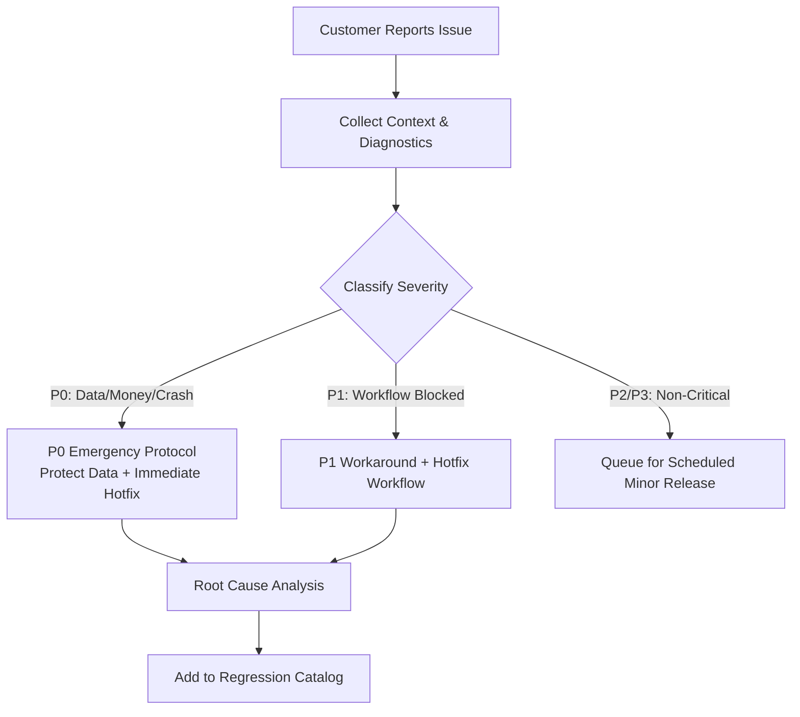

# APKA BILL — PRODUCTION SUPPORT & INCIDENT RUNBOOK
**Document Version**: 1.0.0 (Production Operations)  
**Date**: 2026-08-19  

---

## 1. Support Response Workflow

---

## 2. Incident Classification & SLAs

| Severity | Definition & Examples | Response SLA | Resolution SLA |
|---|---|---|---|
| **P0 — Critical** | Data loss, duplicate financial transaction, wrong bill amount, cross-store data leak, complete app crash on launch. | < 15 mins | < 2 hours |
| **P1 — High** | Sync failure blocking end of day, thermal printer offline with no workaround, login blocked. | < 30 mins | < 6 hours |
| **P2 — Medium** | Minor reporting discrepancy, slow search on large catalog, non-blocking UI glitch. | < 2 hours | < 24 hours |
| **P3 — Low** | Cosmetic alignment, typographical polish, minor UX enhancement. | < 8 hours | Next Sprint |

---

## 3. Subsystem Diagnostic Runbooks

### 3.1 Billing & Checkout Incidents ("Bill Nahi Ban Raha")
1. **Rule #1**: **NEVER tell the customer to clear app data or uninstall.**
2. Check local cart state in UI. If cart has products, verify if stock is sufficient.
3. If checkout fails, inspect `MonitoringService` error log.
4. If local transaction committed but printing failed: **The sale is already safe in SQLite.** Tap **Reprint Receipt** once printer is reconnected.
5. If checkout button was double-tapped: Verify `clientMutationId` prevented duplicate billing.

### 3.2 Thermal Printer Incidents ("Print Nahi Ho Raha")
1. Check Bluetooth/USB physical connection & printer power.
2. Navigate to **Settings $\rightarrow$ Tab 9 (Printing & Hardware)**:
   - Ensure the correct printer profile is marked **Default**.
   - Verify paper width matches installed roll (`58mm` vs `80mm`).
3. Tap **Test Print** from printer settings.
4. If paper is jammed or out of roll: Replace roll and tap **Reprint** from the Bills screen.

### 3.3 Offline Sync & Outbox Incidents ("Sync Nahi Ho Raha")
1. Check internet connectivity status in header badge.
2. Check pending outbox count in **Settings $\rightarrow$ Advanced Diagnostics**.
3. If outbox has pending items: Tap **Sync Now** to trigger single-flight mutex sync.
4. If token expired: Prompt cashier to re-authenticate. **All local outbox items will sync automatically upon successful login.**

---

## 4. Hotfix Release Protocol
1. Branch from production tag: `git checkout -b hotfix/issue-<id>`
2. Apply minimal targeted fix (Zero unrelated architectural refactoring).
3. Run automated regression validator: `node scripts/validate-release.mjs`.
4. If JS-only fix: Deploy via EAS Update channel `production`.
5. If native or migration fix: Bump `versionCode`, build standalone APK/AAB, and deploy.
6. Merge hotfix branch back into `main`.
