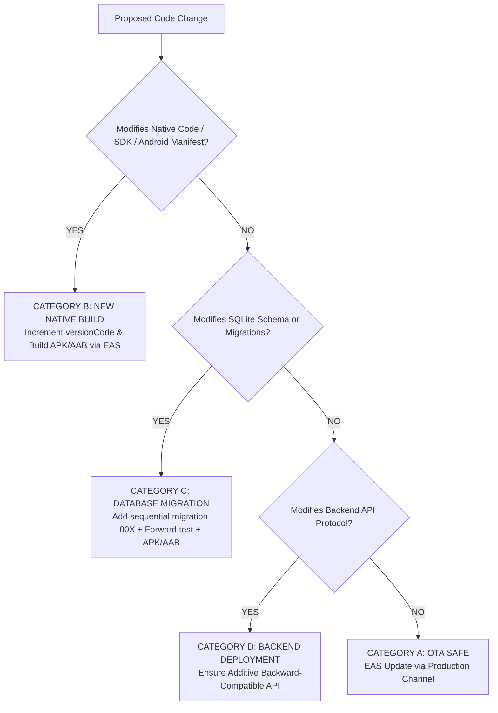

# APKA BILL — PRODUCTION UPDATE & OTA RELEASE STRATEGY
**Document Version**: 1.0.0 (Production Release Framework)  
**Date**: 2026-08-19  

---

## 1. Release Decision Tree

---

## 2. Release Categories

### Category A: OTA Safe (EAS Update)
* **Scope**: JavaScript/TypeScript UI, React components, CSS/styles, localized strings, client-side validation logic, non-native performance tweaks.
* **Compatibility Rule**: Must share the exact same `runtimeVersion` (policy: `appVersion`) as installed native binary.
* **Delivery**: Published to the `production` EAS Update channel.

### Category B: New Native Build Required (EAS Build)
* **Scope**: Changes to `AutoReplyPrint` Android native module, Bluetooth/USB/Camera native permissions, Gradle dependencies, React Native / Expo SDK upgrades.
* **Action**: Increment `android.versionCode` in `app.json` and build new standalone APK / AAB.

### Category C: SQLite Database Schema Migration
* **Scope**: Adding columns, new tables, or index updates.
* **Action**: Append new migration step to `src/database/migrations/` without deleting or resetting previous schemas; test forward migration from existing production DB.

### Category D: Backend Service Releases
* **Scope**: Node.js/Postgres REST endpoints and sync handlers.
* **Action**: Maintain additive, backward-compatible API contracts for legacy client support.

---

## 3. Cashier POS Safety Invariants
1. **Never Update Mid-Checkout**: App never forces restarts or updates while the cart has items or thermal printing is active.
2. **Never Wipe SQLite**: Updates must preserve existing local tables, store settings, and pending outbox mutations.
3. **Rollback Strategy**: If an OTA JS bundle causes rendering errors, the `ErrorBoundary` provides a recovery UI, and EAS Update allows instant rollback to the previous JS release.
